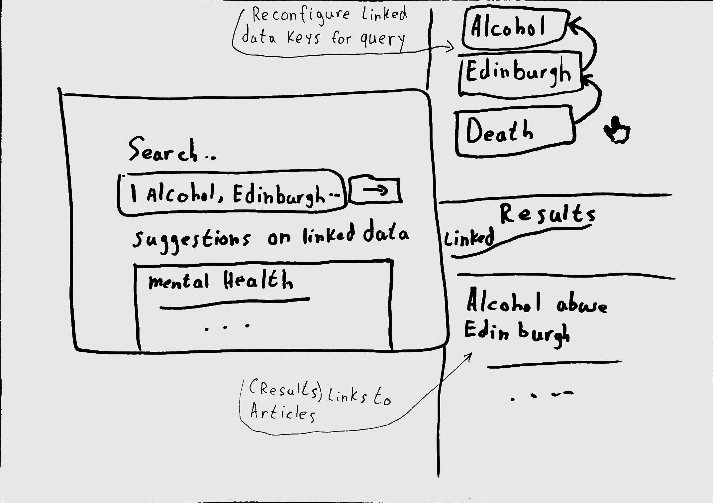
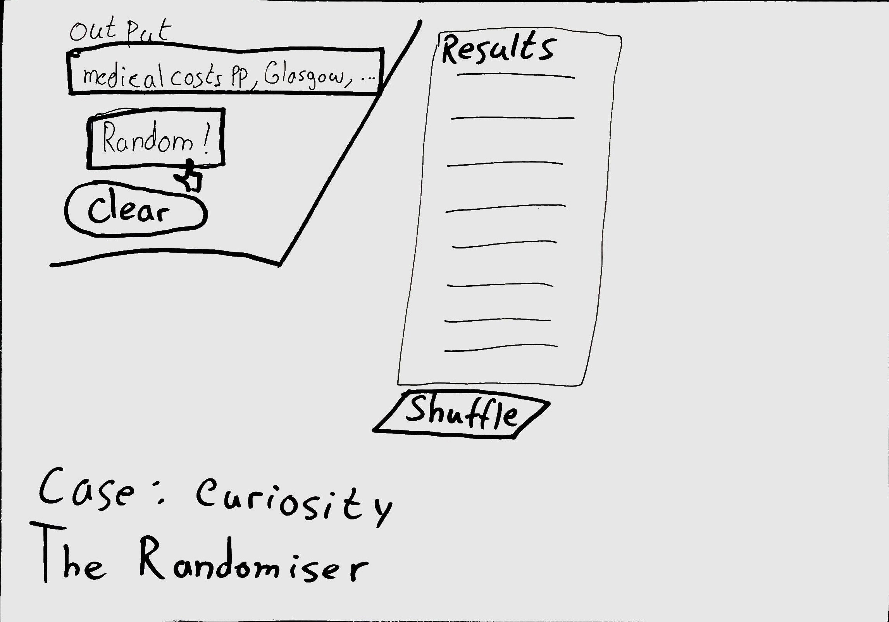
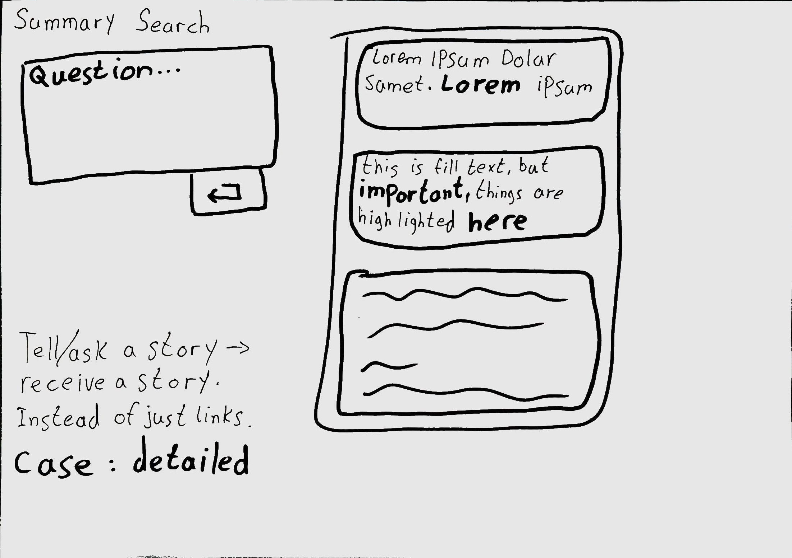
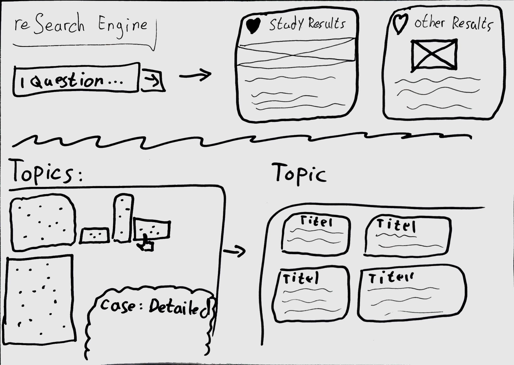

# Product Biografie

## Week 1
In the first week of the project for [Wallscope](https://wallscope.co.uk/) [Antero Duarte](https://www.linkedin.com/in/anterod/) visited Amsterdam to explain some of concepts of the project like 'Linked data'. 

### Linked data  ⃡
A little explanation about linked data (what I remember from his talk): Be sure to check out the [medium article](https://medium.com/wallscope/linked-data-a-conceptual-exploration-9860a1f44d68) Antero made, where he also explains linked data.
So linked data is a way in which data is stored in the database. Nowadays we have table based databases but with linked data you have to look at it like a graph based database. 

**Example**

So for example we have two persons: 'John' and 'Heather'. John has a mother named Heather. So we now know that John and Heather are Linked. This is the basics but we can take it one step further.

Heather also has a daughter named Emma. So all the database now knows is that John has a mother named Heather and Heather has a daughter named Emma. Because of the fact that the data is linked we can now say that John has a sister named Emma! 

This last thing is what I find one of the most interesting this about linked data. Where you actually create new data based on the existing data. 

*Also this week...*

### Edinburgh! ✈
We arrived wednesday afternoon, and got to be your average tourist for the rest of the day 😎. On thursday we attended the Wallscope event at the University in Edinburgh. Here we spoke with the people who store all the public data and the ones who enable people to search this data. But the usability of this search website is very bad which is one of the reasons why we started this project. 

After some presentations we started brainstorming and trying to understand the linked data and how we could fit it in our ideas. 

When starting a new project I always have a lot of ideas. So I just start sketching to try and explain my ideas:
Here the idea is that you start by searching for tags, by which you get certain results. The user can configure the way the tags are linked to get different results. 
||
|----------|-----------|

This idea is focused on the people who don't know what they're looking for. It starts with a button to randomize the query and you directly see the results. The results themself can also be shuffled.
This way the user can get many different unexpected results. 
||
|----------|-----------|

In this idea the user sees a summary of the article as a result, instead of the 'Google' way of showing results with hyperlinks. This way the user asks their question like a story and also receives a story as a result. 
||
|----------|-----------|

**Start of our concept**

This is the sketch which led to our current concept.
Here the user searches for something through an input field. The results have the option to give it a like so it will be stored in their personal 'Topics' (which was later named 'Boards'). In the overview of the different topics the user can see how many articles are stored in the topic by looking at the different sizes. 
||
|----------|-----------|

On the final day of the event we chose to present the idea above to the rest of the attendees. While I was still sketching different ideas the rest of the project group made some first designs of how it might look like. The attendees where pleased with what we came up with in two days. 

## Week 2

