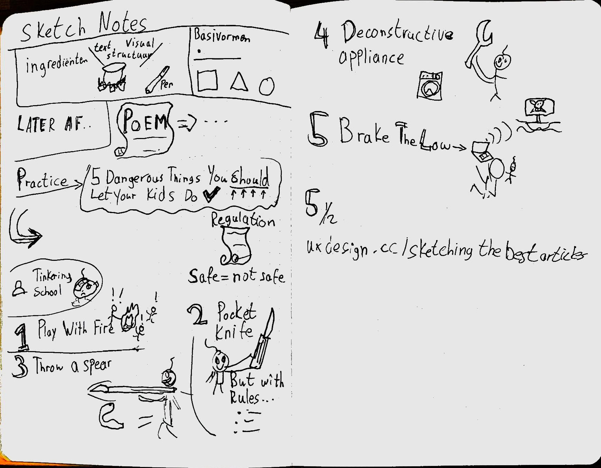
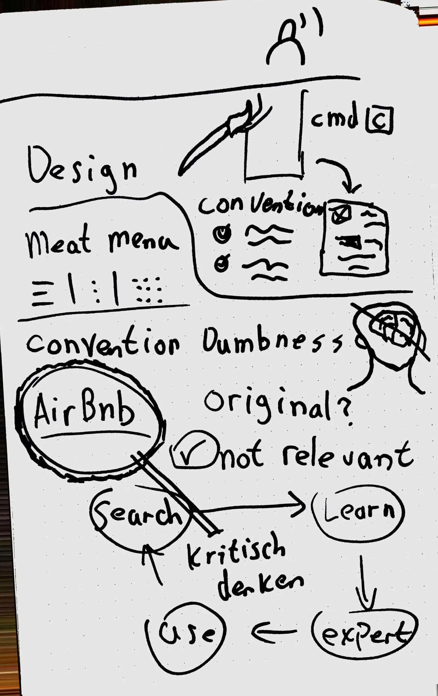
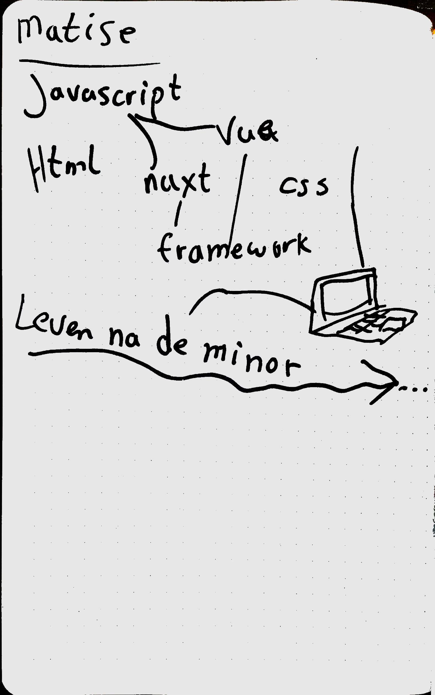
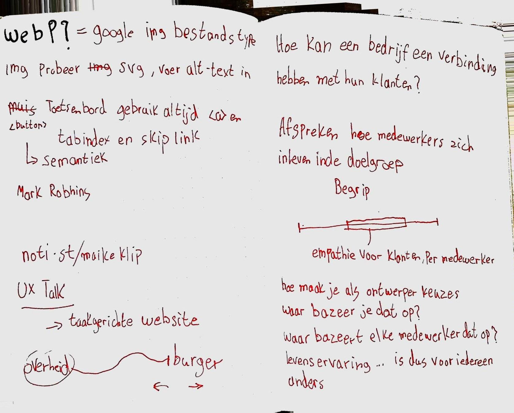
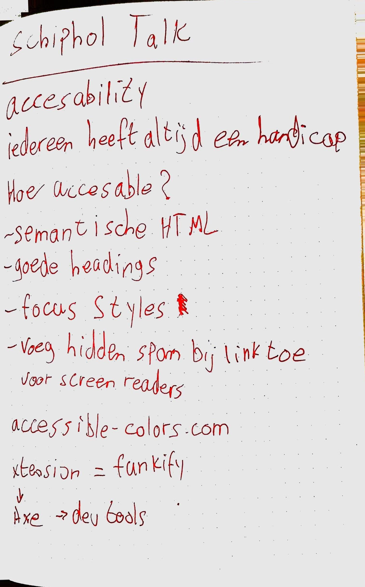

# Weekly Nerd 🤓 / Weekly Mingle 👪

# Overview

# Weekly Nerd - Maaike van Cruchten en Brit Wijnmaalen
Maaike and Brit gave a talk about how and why to 'sketchnote'. The visual aspect helps you remember things better. 

    
Sketchnotes

# Weekly Nerd - Stephan Hay
Stephan Hay talked about why designers should not always just do what others do, because it 'works'. He took a closer look into how and why we use design patterns. And how we should user them. 

    
Sketchnotes

# Weekly Nerd - Cyd Stumpel en Dennis Spierenburg
This weekly nerd Cyd en Dennis talked about life after the minor and how they ended up at Matise. They talked a lot about the developers at Matise and how they operate. 

    
Sketchnotes

# Weekly Nerd - Maike Klip
Maike works for DUO and showed how she did user research. She proved that a UX-designing isn't just about the user but also the company's attitude towards the users. 

    
Sketchnotes

# Weekly Nerd - Ischa Gast @Schiphol
This talk at schiphol was mainly focused on accesebility and how they try to improve the accesebility on their products, such as the schiphol website. Also a blind person spoke about how he uses the web, which was a real eye-opener to see. 

    
Sketchnotes

